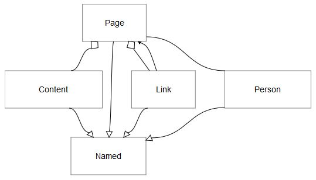

# JointJS Example - JavaScript diagramming library
This example of JointJS shows:
	1. How to insert multiple arrows (see the ones between Page and Link)
	2. How to dynamically insert entities
	3. How to use Dagre to create autotimatically layouts for entities and links
	4. How to dynamically decide attributes for links and entities

#Thanks
It is based on opensource material:
	1. the official one (Joint JS tutorial) http://resources.jointjs.com/tutorial
	2. https://github.com/srikusri/JointJS-Example

#How to launch
Simply download the repository and launch index.html (or one the other ones) with your browser.

#Author
HerrAugust - https://github.com/HerrAugust